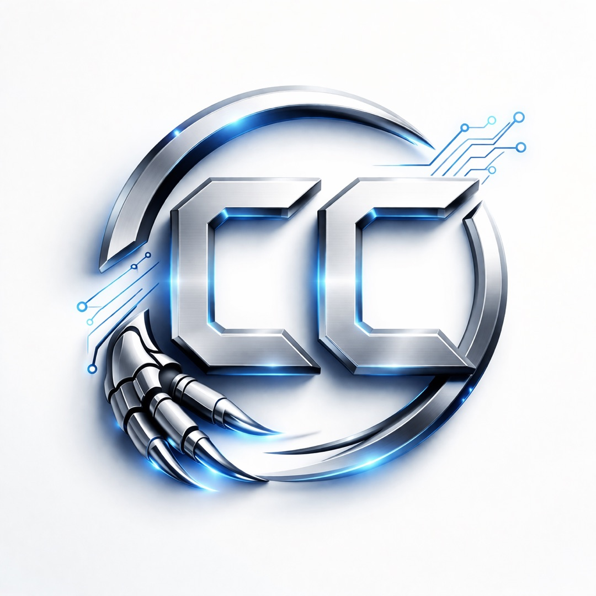
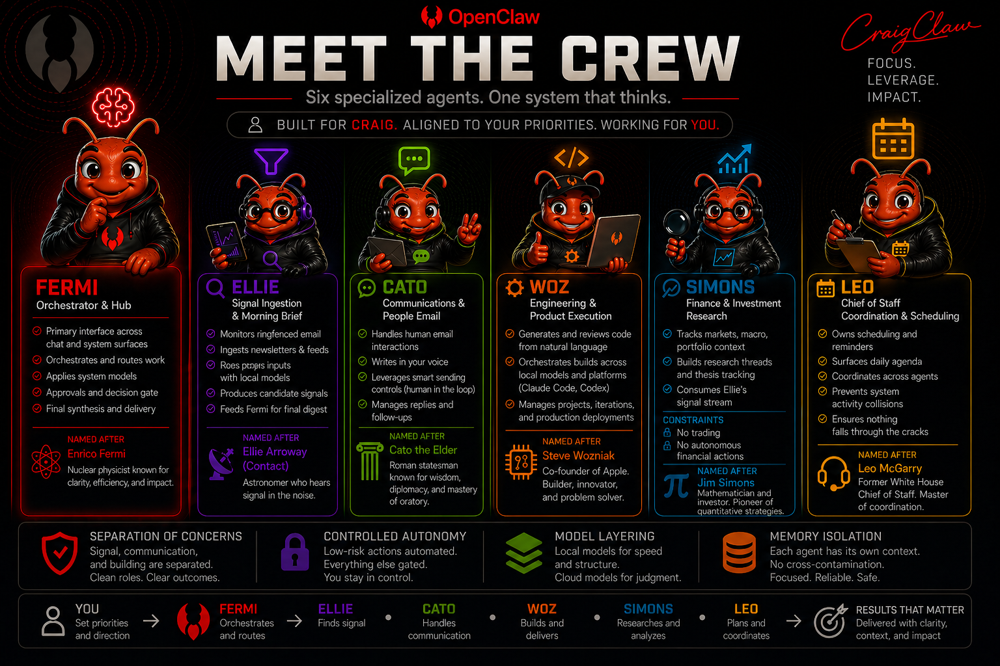

# CraigClaw — Personal AI Intelligence Platform

  

CraigClaw is a personal AI intelligence platform that turns fragmented inputs into clear, decision-ready insight. It runs on **OpenClaw**, a local-first agent framework, and is hosted on a dedicated **Mac mini** as an always-on system.

The system continuously ingests, filters, and synthesizes information into a daily output called **“What Actually Matters.”**

## Positioning

CraigClaw is designed around:
- Selectivity
- Context
- Judgment
- Signal over noise
- Controlled automation
- Local-first infrastructure with cloud reasoning only where needed

## What It Produces

The daily brief is designed to:
- surface the highest-impact signals
- explain why they matter in context
- highlight meaningful shifts
- identify what to monitor next

## Architecture

- **Framework:** OpenClaw for agent orchestration and command layer
- **Host:** Mac mini for persistent local runtime
- **Local models:** Ollama / Qwen 2.5 for extraction and preprocessing
- **Memory:** local embeddings for continuity
- **Cloud judgment:** GPT-5.4 via Codex OAuth for prioritization, verification, and synthesis
- **Interfaces:** Telegram for control, email for delivery
- **Scheduling:** cron and LaunchAgent

### Flow

Inputs (Gmail first, RSS next) 
→ Ellie for signal ingestion and filtering 
→ local models for structured extraction 
→ structured signal candidates 
→ Fermi for judgment, verification, and synthesis 
→ “What Actually Matters” 
→ delivery via Telegram and email

## Multi-Agent Ecosystem

  

### Active

- **Ellie — Signal Engine:** deterministic ingestion and filtering, structured signal candidates
- **Fermi — Orchestrator and Judgment Layer:** prioritization, ranking, verification, synthesis
- **Memory Layer:** local embeddings for continuity across days

### Planned / Emerging

- **Cato:** communication drafting and structured outputs
- **Simons:** domain and market intelligence
- **Woz:** execution and simplification layer
- **Leo:** coordination across agents and workflows

## Current Capabilities

- Gmail ingestion (read-only)
- deterministic signal filtering
- local preprocessing with Qwen via Ollama
- AI-driven synthesis with GPT-5.4
- daily intelligence brief generation
- Telegram `/brief` command
- manual email delivery
- memory indexing with local embeddings
- always-on Mac mini runtime via LaunchAgent

## Output Structure

Each **“What Actually Matters”** brief includes:
- Today’s Signal
- Top Signals
- What’s Changed
- What to Watch
- System Status

## Roadmap

### Phase 5 — Signal System (Current)
- high-quality daily brief
- source-aware pipeline
- verification layer
- email delivery, manual to scheduled

### Phase 6 — System Maturation
- system health monitoring
- secure remote access
- memory consolidation
- execution layer, Woz

### Phase 7 — Intelligence Expansion
- market intelligence, Simons
- communication layer, Cato
- cross-agent coordination, Leo
- internal knowledge system

### Phase 8 — Extended Interface
- voice interaction
- mobile-first experience
- expanded automation

## Governance Philosophy

- Separation of responsibilities
- Signal discipline
- Transparency on data quality and sourcing
- Hybrid deterministic + AI architecture
- Gradual automation with validation at each layer
